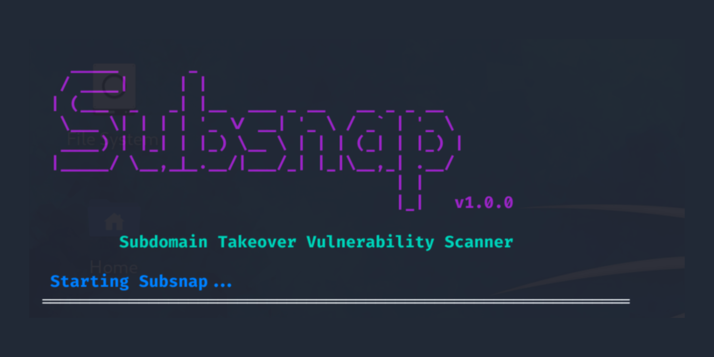

# subsnap



## Table of Contents

- [About](#about)
- [Features](#features)
- [Installation](#installation)
- [Usage](#usage)
- [Contributing](#contributing)

## About

**Subsnap** is an automated subdomain takeover vulnerability scanner designed to identify and exploit subdomain misconfigurations across various platforms. It combines multiple subdomain discovery tools and vulnerability checks to provide a comprehensive assessment of a target domain's security. 

**What It Does**:
Subsnap automates the process of discovering subdomains, checking their DNS records, probing for live hosts, and identifying potential subdomain takeover vulnerabilities. It captures detailed information, such as CNAME records, and uses tools like Subzy and Eyewitness to detect vulnerable subdomains and capture screenshots of live hosts.

**Why It's Useful**:
Subdomain takeover is a significant security risk that can allow attackers to hijack unused or misconfigured subdomains and host malicious content. Subsnap streamlines the identification of these vulnerabilities, making it easier for security professionals to protect their domains from such attacks. By automating the enumeration and validation processes, Subsnap saves time and increases the accuracy of detecting vulnerable subdomains, making it an essential tool in any web security arsenal.

## Features

**Features of Subsnap**:

1. **Automated Subdomain Enumeration**:
   - Integrates multiple tools (`subfinder`, `assetfinder`, `sublist3r`) to discover subdomains associated with a target domain.

2. **Live Subdomain Detection**:
   - Identifies and lists live subdomains using `httpx-toolkit`, ensuring the discovered subdomains are active and accessible.

3. **Subdomain Takeover Vulnerability Detection**:
   - Uses `Subzy` to check for potential subdomain takeover vulnerabilities, identifying subdomains that could be hijacked by attackers.

4. **CNAME Record Checking**:
   - Inspects CNAME records for discovered subdomains, helping to identify potential points of vulnerability related to domain name resolution.

5. **Specific CNAME Pattern Identification**:
   - Searches for CNAME patterns commonly associated with vulnerable services, such as GitHub Pages, Amazon S3, Heroku, and ReadMe.io.

6. **Screenshot Capturing**:
   - Automatically captures screenshots of live subdomains using `Eyewitness`, providing visual confirmation of the current content hosted on the subdomains.

7. **Concurrency and Timeout Control**:
   - Allows customization of concurrency levels and timeouts for HTTP probes and screenshot capturing, giving users control over the speed and depth of the scan.

8. **Output Management**:
   - Saves results to a specified directory, organizing subdomains, live subdomains, vulnerable subdomains, CNAME records, and screenshots into easily accessible files.

## Installation

### Steps

1. **Clone the repository**:
    ```bash
    git clone https://github.com/ansari-khursaid7tr/subsnap.git
    cd subsnap
    ```

2. **Run the installation script**:
    ```bash
    chmod +x install.sh
    ./install.sh
    ```

3. **Make the main script executable**:
    ```bash
    chmod +x subsnap.sh
    ```

## Usage

Run Subsnap with the following command: ```bash ./subsnap.sh -d example.com ```

For more options, use the help command: ```bash ./subsnap.sh -h ```

## Contributing

Contributions are welcome! 

We're inviting contributions to the **Subsnap** repository to help make it a more powerful and comprehensive tool for detecting subdomain takeover vulnerabilities. Whether you're a developer, security researcher, or enthusiast, your expertise can help improve Subsnap's features, efficiency, and usability. From adding new detection methods to enhancing existing functionality, your contributions will be invaluable in making Subsnap an even more essential tool for securing web assets. Join us in making Subsnap the go-to solution for subdomain security.

